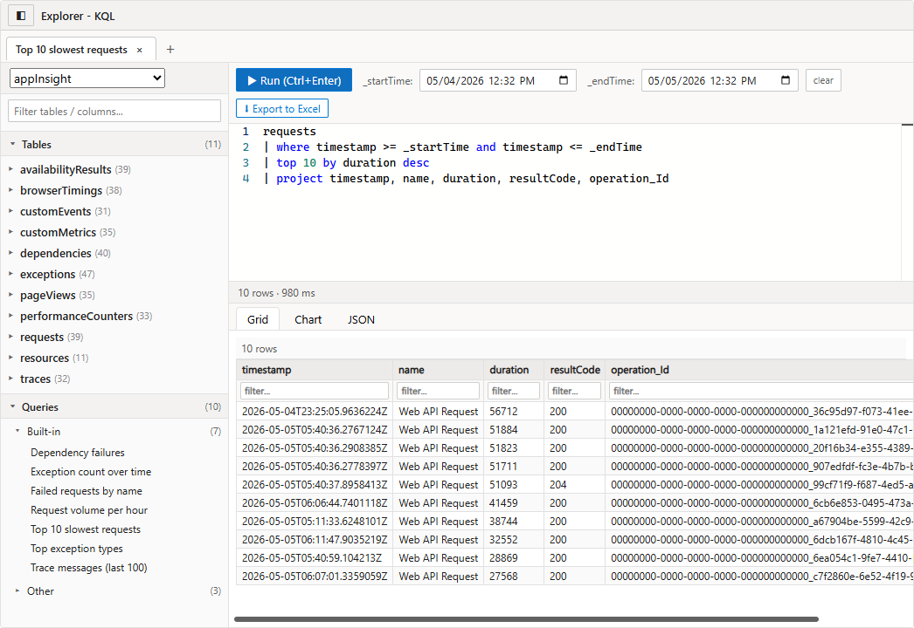

# Explorer-KQL

> **Disclaimer.** This is a personal, open-source project. It is **not a Microsoft product, not endorsed by Microsoft, and not supported through any Microsoft support channel.** I happen to work at Microsoft; this repository represents my own work, opinions, and experiments and does not reflect those of my employer. Use at your own risk under the terms of the [MIT License](LICENSE).

An in-form **Application Insights / KQL query editor** for Dynamics 365 model-driven apps. A virtual PCF (React/TypeScript) control hosts a full Kusto editor — tabs, schema tree, saved queries, time pickers, grid / chart / JSON output, Excel export — directly inside the model-driven form. Azure credentials live once in a Dataverse-side service principal (held by a server-side plugin); end users never need direct Azure access.



---

## Why this exists

Application Insights is increasingly where the diagnostic *truth* lives for a Dataverse application. Plugin trace logs, Power Automate run history, custom telemetry, and now **Conversation Diagnostics** for Copilot Studio / agent flows all flow into Application Insights — the surface that used to live inside Dataverse has effectively moved to Azure Monitor.

Most organizations do provision the Azure subscription and the Application Insights resource — that part is rarely the blocker. The blocker is granting **per-user RBAC** on it, and then asking a business owner to leave the model-driven app they live in, sign in to the Azure portal, find the right resource, and learn the Logs blade just to answer a question about *their own* application. From a UX standpoint that's overwhelming — it feels like *"that's not mine, that's some ops team's territory"*, and the user disengages.

Explorer-KQL inverts that. Azure credentials live **once** in a single Dataverse-side service principal (held by the plugin), and any user the admin trusts gets a full KQL editor — tabs, schema tree, saved queries, time pickers, grid/chart/JSON output, Excel export — right inside the model-driven form they already use every day. No Azure portal hop, no per-user RBAC, no context switch.

---

## What ships

| Component | Type | Name |
|---|---|---|
| PCF custom control | CustomControl | `vip_vip.KustoExplorer` |
| Plugin assembly (signed, ~30 KB) | PluginAssembly | `vip.AzureMonitorQuery` |
| Plugin step | SdkMessageProcessingStep | Stage 30 on `vip_azuremonitorquery` |
| Custom API | CustomApi | `vip_azuremonitorquery` (4 ops: query / schema / apps / savedqueries) |
| Web resource | WebResource | `vip_/js/kustoexplorer_form.js` |
| **Custom form** on `systemuser` | SystemForm (behavior=2, metadata-only) | "Kusto Explorer" — leaves OOB User forms untouched |
| **Custom security role** | Role | "PPAC Kusto Reader" — least-privilege role for operators |
| Environment variable definitions × 4 | EnvironmentVariableDefinition | `vip_AppInsightsAppId`, `vip_AppInsightsTenantId`, `vip_AppInsightsClientId`, `vip_AppInsightsClientSecret` |

> **Values are *not* shipped.** The exported zip carries the four env-var **definitions** but no **values**. The maker-portal import wizard will prompt for each value, or the plugin will fail at runtime when it tries to read the secret. This is intentional fail-fast behavior so no tenant's credentials are ever baked into the published artifact.

---

## Install

1. **Download the managed solution** — [`KustoExplorerSolution_1_0_3_managed.zip`](dist/KustoExplorerSolution_1_0_3_managed.zip) (or grab from [GitHub Releases](https://github.com/SweetsNSavories/Explorer-KQL/releases)).
2. In [make.powerapps.com](https://make.powerapps.com), pick the target environment → **Solutions → Import solution** → upload the zip.
3. The wizard will ask you for the four environment-variable values. Provide them now (or set later under **Solutions → Default Solution → Environment variables**).
4. Assign the **PPAC Kusto Reader** security role to any user who should be able to run KQL.
5. Open any User record in the model-driven app, switch to the **Kusto Explorer** form, and start querying.

### Environment variables

| Schema name | Type | Description |
|---|---|---|
| `vip_AppInsightsTenantId` | Text | Microsoft Entra tenant GUID that owns the SP. |
| `vip_AppInsightsClientId` | Text | Application (client) ID of the SP. |
| `vip_AppInsightsClientSecret` | Secret | Client secret value. In Key-Vault-backed environments this is a KV reference; otherwise encrypted at rest by Dataverse. |
| `vip_AppInsightsAppId` | Text (JSON array) | List of Application Insights instances to expose to the control. |

Set `vip_AppInsightsAppId` to a JSON array, one entry per AI resource:

```json
[
  {
    "name":  "DynamicsOfficeWebhook",
    "appId": "00000000-0000-0000-0000-000000000000",
    "armId": "/subscriptions/<sub>/resourceGroups/<rg>/providers/Microsoft.Insights/components/<ai-name>"
  }
]
```

- **name** — friendly label in the per-tab AI selector.
- **appId** — the GUID under *Application Insights → Configure → API Access → Application ID*.
- **armId** — full ARM resource ID (required for query-pack discovery and `analyticsItems` lookups).

### Azure permissions

Grant the SP these RBAC roles on **each** Application Insights resource referenced above:

- **Monitoring Reader** on the AI resource (control plane: `analyticsItems`, query packs).
- The SP must also have API access on the AI resource for the data plane (`api.applicationinsights.io`). Add it under *AI → Configure → API Access*.

---

## Architecture

```
PCF control (React/TS)        Xrm.WebApi.execute({ vip_azuremonitorquery })
in the model-driven form ─────────────────────────────────────────────┐
                                                                       ▼
                                       Custom API: vip_azuremonitorquery
                                       (Stage 30 plugin step)
                                                ▲
                                                │ https
                                                ▼
                          login.microsoftonline.com / token  (client-credentials, SP)
                                                │
                                  ┌─────────────┴─────────────┐
                                  ▼                           ▼
                  api.applicationinsights.io          management.azure.com
                  (query / metadata)                  (queryPacks, analyticsItems)
```

The control never holds Azure credentials. It speaks **only** to a Dataverse Custom API. The plugin is the trust boundary — it owns the SP, mints AAD tokens, and proxies the call.

Two AAD scopes are used:

- `https://api.applicationinsights.io/.default` — data plane (KQL + metadata).
- `https://management.azure.com/.default` — control plane (query packs & analyticsItems lists).

---

## Inside the plugin

The natural instinct is to `dotnet add package Azure.Monitor.Query` and call it a day — but the Dataverse plugin **sandbox** blocks almost every transitive dependency that modern Azure SDK clients need (`System.Memory`, `System.Buffers`, MSAL, dependency-injection helpers, etc.). Even with ILMerge / ILRepack, the sandbox's strict assembly-load rules reject most of them at runtime.

The pragmatic answer is to keep the plugin's reference graph **tiny** and call the same REST endpoints the SDK would call under the hood:

```xml
<ItemGroup>
  <PackageReference Include="Microsoft.CrmSdk.CoreAssemblies" Version="9.0.2.54" />
  <PackageReference Include="Newtonsoft.Json"               Version="13.0.3"  />
  <Reference          Include="System.Net.Http" />
</ItemGroup>
```

Total plugin DLL size: **~30 KB**. No ILMerge, no shadow copies of MSAL or Azure.Identity, nothing that the sandbox can refuse to load.

### REST endpoints used

| Operation | Endpoint | Auth scope | Reference |
|---|---|---|---|
| `query` | `POST /v1/apps/{appId}/query` | `api.applicationinsights.io/.default` | [REST: Query — Execute](https://learn.microsoft.com/rest/api/application-insights/query/execute) |
| `schema` | `GET /v1/apps/{appId}/metadata` | `api.applicationinsights.io/.default` | [REST: Metadata — Get](https://learn.microsoft.com/rest/api/application-insights/metadata/get) |
| `savedqueries` (per-app legacy) | `GET {armId}/analyticsItems?api-version=2015-05-01&scope=shared&type=query&includeContent=true` | `management.azure.com/.default` | [ARM: AnalyticsItems — List](https://learn.microsoft.com/rest/api/application-insights/analytics-items/list) |
| `savedqueries` (query packs) | `GET /subscriptions/{sub}/resourceGroups/{rg}/providers/Microsoft.Insights/queryPacks?api-version=2019-09-01-preview` + per-pack `/queries` | `management.azure.com/.default` | [ARM: Query Packs](https://learn.microsoft.com/rest/api/loganalytics/query-packs) |

These are first-party, OpenAPI-described endpoints — exactly the same ones the official `Azure.Monitor.Query` SDK is generated from. See [`azure-rest-api-specs`](https://github.com/Azure/azure-rest-api-specs/tree/main/specification/applicationinsights).

---

## Custom form & security role

### "Kusto Explorer" form on `systemuser`

The control runs on a **new, dedicated form** on `systemuser` called *Kusto Explorer* (`formid = 69c22e59-1888-4d06-9afb-4d301a3a5d2f`). It is exported with `behavior="2"` (metadata-only), so existing Main / Quick-Create / Card forms on the User table are left exactly as they are.

Why systemuser? Every Dataverse environment already has a User table and a User form selector in the model-driven app. By piggy-backing on it, Explorer-KQL does **not** introduce a new table, a new sitemap area, or a new app — an admin opens any user record, switches to *Kusto Explorer*, and the PCF takes over the full canvas.

### "PPAC Kusto Reader" role

A least-privilege role (`roleid = 08d61102-7247-f111-bec6-7c1e5267f8c3`) so that an operator with *only* this role plus the standard Basic User role can open the form and execute queries. All privileges granted at **Global** scope:

| Privilege | Why |
|---|---|
| `prvReadUser` | Open `systemuser` records so the form can be displayed. |
| `prvReadEntity`, `prvReadCustomization`, `prvReadWebResource` | Render the form and load the PCF/web-resource bundles. |
| `prvReadCustomAPI`, `prvReadSdkMessage`, `prvReadSdkMessageProcessingStep`, `prvReadSdkMessageProcessingStepImage` | Discover and invoke `vip_azuremonitorquery`. |
| `prvReadPluginAssembly`, `prvReadPluginType` | Resolve the plugin that backs the Custom API. |
| `prvReadEnvironmentVariableDefinition` | Resolve the four `vip_AppInsights*` env vars. |
| `prvReadOrganization` | Standard org-settings read used by the form runtime. |

**What it does NOT grant:** no write/create/delete on any business data, no plugin registration access, no System Administrator equivalence.

---

## Build from source

```powershell
# 1. Plugin (NuGet restore + signed DLL)
cd PreOpPlugin
dotnet build -c Release
# → bin\Release\net462\vip.AzureMonitorQuery.dll  (~30 KB)

# 2. Push DLL into Dataverse via Web API (no Plugin Registration Tool)
cd ..\deploy
node push-plugin.mjs

# 3. Build & push the PCF (React/TS bundle)
cd ..\KustoExplorerControl
pac pcf push --publisher-prefix vip

# 4. Re-export the whole thing as a managed solution zip
cd ..\deploy
node export-solution.mjs       # writes dist\KustoExplorerSolution_*_managed.zip
```

> The `export-solution.mjs` script post-processes the zip to delete every `environmentvariablevalues.json` so no tenant's secret is ever shipped.

> Scripts under `deploy/` that need an SP secret read it from `$env:AAD_CLIENT_SECRET`. Most scripts (push-plugin, export-solution, copy-webresources, …) authenticate as you via MSAL device-code and need no secret at all.

---

## Documentation

- **Full blog post (HTML):** [`dist/blog/Explorer-KQL.html`](dist/blog/Explorer-KQL.html)
- **Full blog post (PDF):** [`dist/blog/Explorer-KQL.pdf`](dist/blog/Explorer-KQL.pdf)

---

## Trademarks & attribution

Microsoft, Azure, Dynamics 365, Dataverse, Power Platform, Power Apps, Application Insights, and Azure Monitor are trademarks of the Microsoft group of companies. This project is an independent personal effort and is not affiliated with, sponsored by, or endorsed by Microsoft.

## License

[MIT](LICENSE) © 2026 Praveen Kumar.
